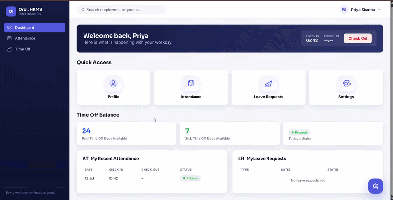
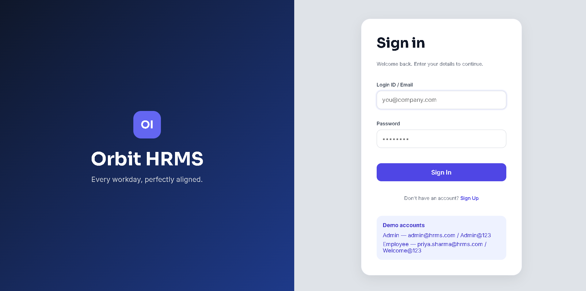
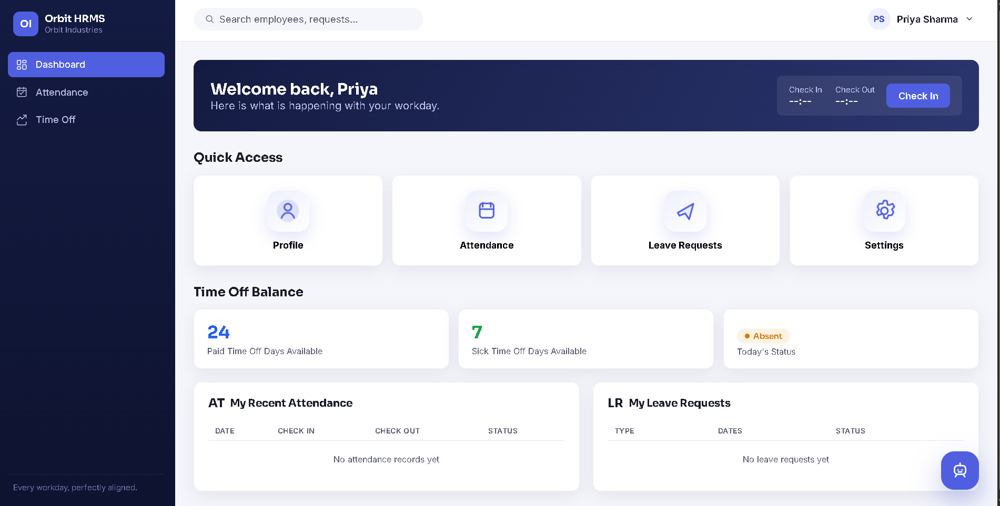
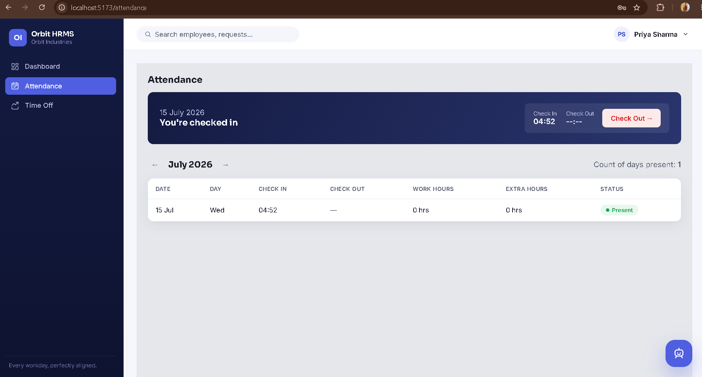
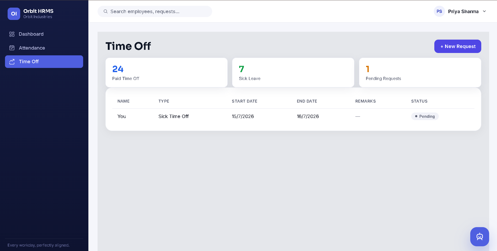
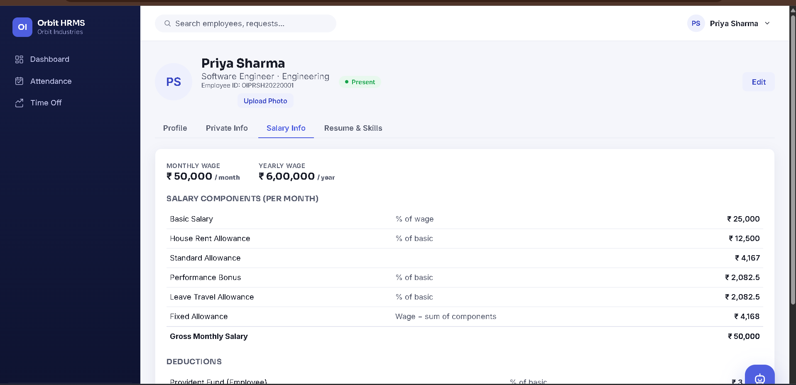
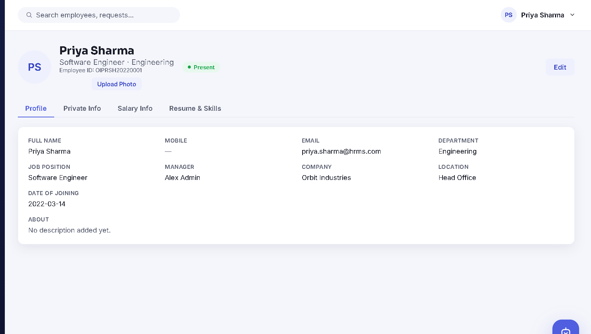

<div align="center">

# 🚀 Orbit HRMS
### Enterprise Human Resource Management System

<p align="center">
A modern full-stack Human Resource Management System built with Node.js, Express, React, and JWT Authentication.
</p>

<p align="center">


</p>

</div>

---

# 📌 Overview

Orbit HRMS is a modern Human Resource Management System designed for organizations to efficiently manage employees, attendance, payroll, leave management, authentication, and employee profiles from a single dashboard.

The project follows a scalable full-stack architecture using React for the frontend and Express.js for the backend while storing data in a lightweight JSON database.

---
## 🎥 Live Demo Preview

<p align="center">
  
</p>

# ✨ Features

## 🔐 Authentication

- Secure Login
- Secure Registration
- JWT Authentication
- Password Hashing using bcrypt
- Role Based Authorization
- Protected Routes

---

## 👥 Employee Management

- Employee Directory
- Employee Profiles
- Personal Information
- Skills & Resume Section
- Salary Details
- Editable Employee Information

---

## 📅 Attendance Management

- Daily Check-in
- Daily Check-out
- Working Hours Calculation
- Overtime Calculation
- Attendance History
- Monthly Attendance Records

---

## 🌴 Leave Management

- Apply Leave
- Sick Leave
- Paid Leave
- Unpaid Leave
- Leave Approval Workflow
- HR Comments
- Leave Balance Tracking

---

## 💰 Payroll Management

- Salary Breakdown
- Net Salary
- HRA
- PF
- Professional Tax
- Performance Bonus
- Salary Component Management

---

## 📊 Dashboard

### Employee Dashboard

- Attendance Status
- Leave Balance
- Profile Overview
- Quick Actions

### Admin Dashboard

- Employee Monitoring
- Attendance Overview
- Employee Status
- Payroll Management

---

# 🛠 Tech Stack

## Frontend

- React
- Vite
- React Router
- Axios
- CSS3

## Backend

- Node.js
- Express.js
- JWT
- bcrypt

## Database

- JSON File Database

---

# 📂 Project Structure

```text
Orbit-HRMS
│
├── backend
│   ├── db
│   ├── middleware
│   ├── routes
│   ├── services
│   ├── uploads
│   ├── package.json
│   └── server.js
│
├── frontend
│   ├── src
│   │   ├── components
│   │   ├── context
│   │   ├── pages
│   │   ├── styles
│   │   └── main.jsx
│   ├── package.json
│   └── vite.config.js
│
└── README.md
```

---

# ⚙️ Installation

## Clone Repository

```bash
git clone https://github.com/rajnarharia/Orbit-HRMS.git
```

```
cd Orbit-HRMS
```

---

# Backend Setup

```
cd backend
npm install
npm start
```

Runs on

```
http://localhost:5000
```

---

# Frontend Setup

```
cd frontend
npm install
npm run dev
```

Runs on

```
http://localhost:5173
```

---

# 🔑 Demo Credentials

## Admin

| Email | Password |
|---------|------------|
| admin@hrms.com | Admin@123 |

---

## Employee

| Email | Password |
|---------|------------|
| priya.sharma@hrms.com | Welcome@123 |

---

# 📸 Screenshots

> Add screenshots here

- Login Page
- Dashboard
- Employee Management
- Attendance
- Payroll
- Leave Management

---

# 🔒 Security

- JWT Authentication
- Password Hashing
- Protected API Routes
- Role Based Access
- Secure Session Management

---
# 📸 Application Screenshots

## 🔐 Login Page



---

## 📊 Dashboard



---

## 📅 Attendance Management



---

## 🌴 Leave Management



---

## 💰 Payroll Management



---

## 👤 Employee Profile



# 🚀 Future Improvements

- MongoDB Integration
- Docker Support
- AWS Deployment
- Email Notifications
- Performance Analytics
- AI HR Assistant
- Resume Screening AI
- Face Attendance
- Biometric Integration

---

# 🤝 Contributing

Contributions are welcome.

1. Fork the Repository

2. Create a Feature Branch

```
git checkout -b feature-name
```

3. Commit Changes

```
git commit -m "Added new feature"
```

4. Push Changes

```
git push origin feature-name
```

5. Open a Pull Request

---

# 📜 License

This project is licensed under the MIT License.

---

# 👨‍💻 Developer

**Raj Narharia**

Artificial Intelligence Engineer

GitHub

https://github.com/rajnarharia

---

<div align="center">

⭐ Star this repository if you found it useful.

</div>